# Community Content Hub - UML设计文档

**文档版本**: v2.0
**编写日期**: 2026-02-06
**UML工具**: Mermaid（文本格式）

---

## 1. 领域模型类图 (Domain Model Class Diagram)

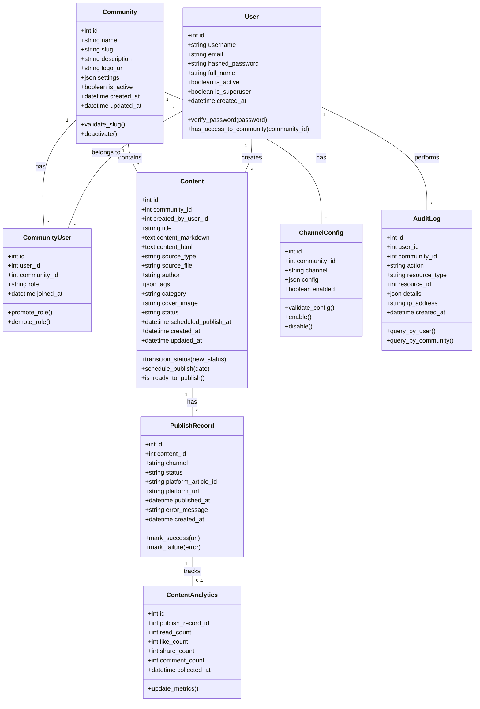

---

## 2. 核心服务类图 (Service Layer Class Diagram)

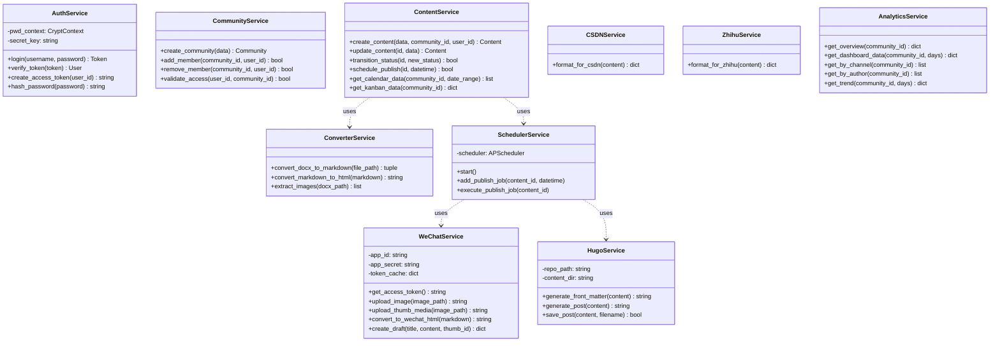

---

## 3. 用户登录时序图 (Login Sequence Diagram)

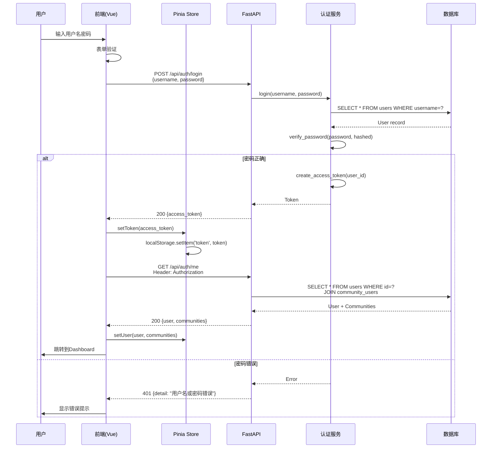

---

## 4. 社区切换时序图 (Community Switching Sequence)

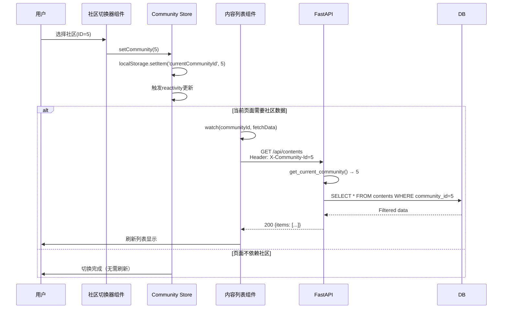

---

## 5. 内容发布到微信时序图 (WeChat Publishing Sequence)

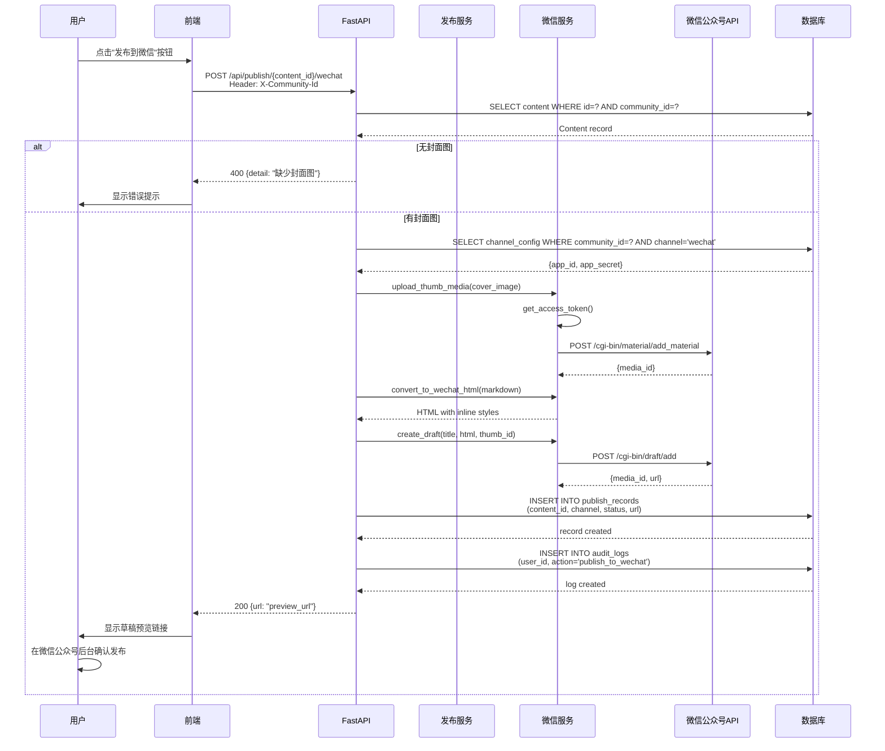

---

## 6. 日历视图拖拽排期时序图 (Calendar Drag & Drop Sequence)

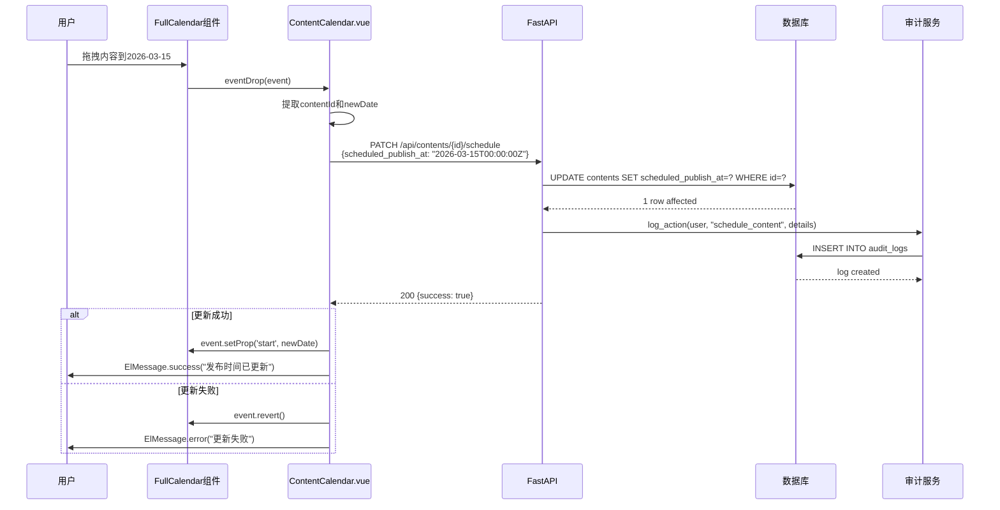

---

## 7. 看板视图拖拽改状态时序图 (Kanban Drag & Drop Sequence)

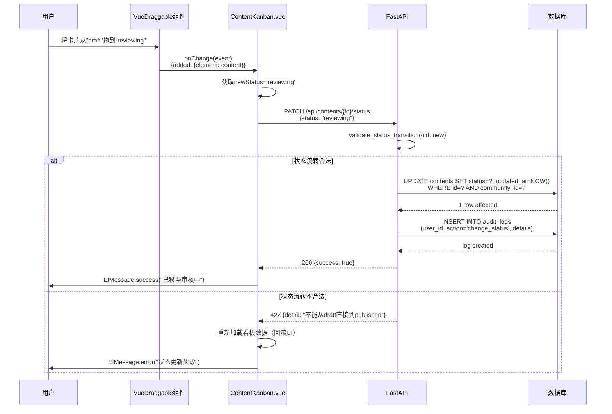

---

## 8. 数据分析仪表板加载时序图 (Analytics Dashboard Loading)

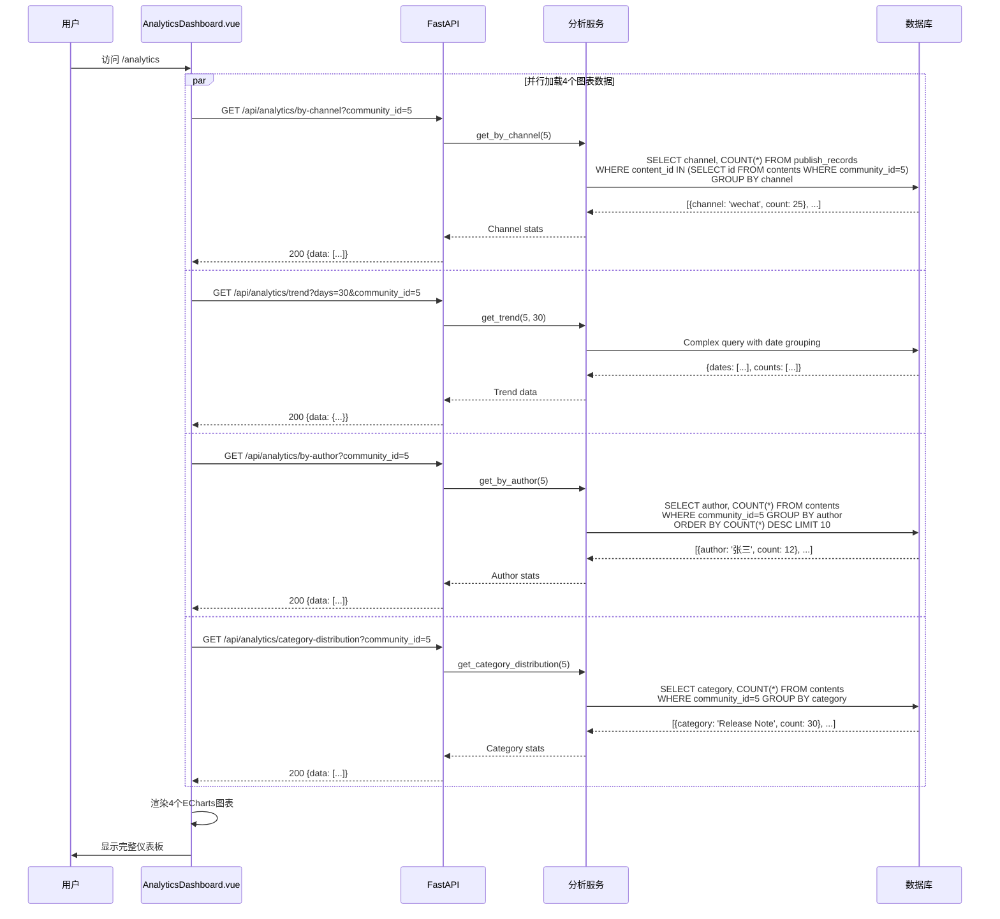

---

## 9. 状态机图 - 内容状态流转 (Content Status State Machine)

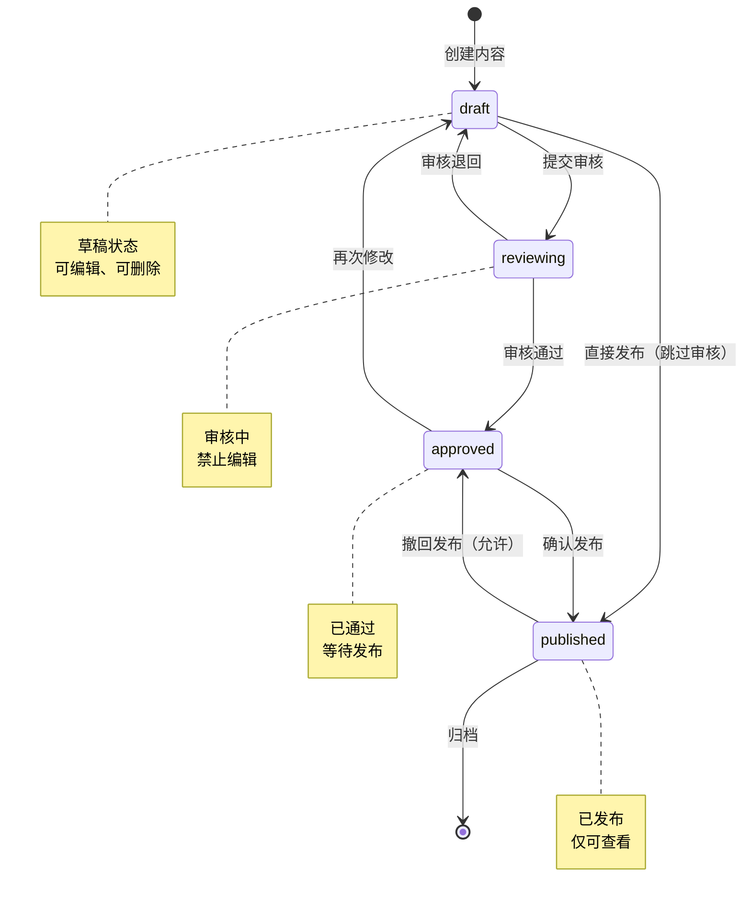

**状态转换规则**:
| 当前状态 | 允许转换到 | 禁止转换到 |
|---------|-----------|-----------|
| draft | reviewing, published | approved |
| reviewing | approved, draft | published |
| approved | published, draft | reviewing |
| published | approved, archived | draft, reviewing |

---

## 10. 活动图 - WORD文件上传处理流程 (Activity Diagram)

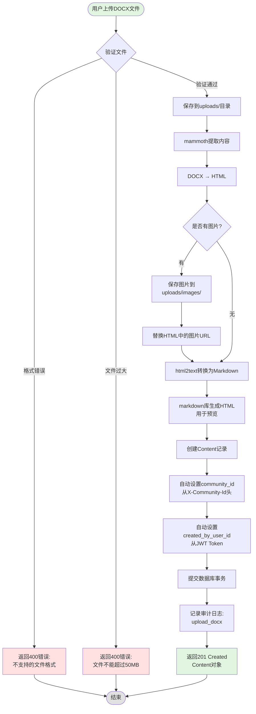

---

## 11. 部署图 (Deployment Diagram)

```mermaid
graph TB
    subgraph "用户设备"
        Browser[Web浏览器<br/>Chrome/Firefox]
    end

    subgraph "Docker主机"
        subgraph "Frontend容器"
            Nginx[Nginx<br/>静态文件服务器]
            VueApp[Vue 3 SPA<br/>打包后的静态文件]
        end

        subgraph "Backend容器"
            Uvicorn[Uvicorn<br/>ASGI服务器]
            FastAPI[FastAPI应用<br/>Python 3.11]
        end

        subgraph "Database容器"
            Postgres[(PostgreSQL 15<br/>数据库)]
        end

        subgraph "存储卷"
            Uploads[/uploads<br/>文件存储]
            DBData[/var/lib/postgresql<br/>数据文件]
        end
    end

    subgraph "外部服务"
        WeChatAPI[微信公众号API<br/>api.weixin.qq.com]
        HugoRepo[Hugo仓库<br/>Git远程仓库]
    end

    Browser -->|HTTPS:443| Nginx
    Nginx -->|Proxy Pass<br/>:8000| Uvicorn
    FastAPI -->|SQLAlchemy| Postgres
    FastAPI -->|文件读写| Uploads
    Postgres -->|持久化| DBData
    FastAPI -->|HTTPS| WeChatAPI
    FastAPI -->|Git Push| HugoRepo

    style Browser fill:#e1f5e1
    style Nginx fill:#cce5ff
    style FastAPI fill:#ffcccc
    style Postgres fill:#fff3cd
    style Uploads fill:#f0f0f0
    style WeChatAPI fill:#e1f5e1
```

---

## 12. 包图 (Package Diagram)

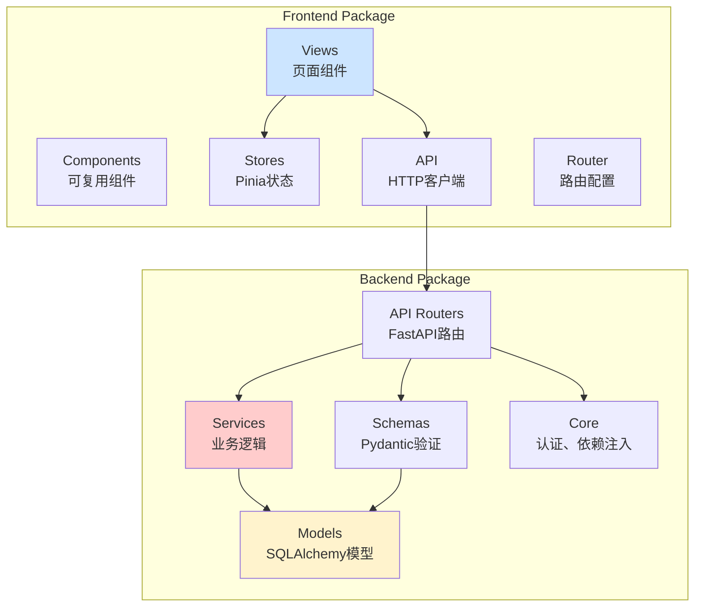

---

## 13. 组件图 - 前端组件依赖 (Frontend Component Diagram)

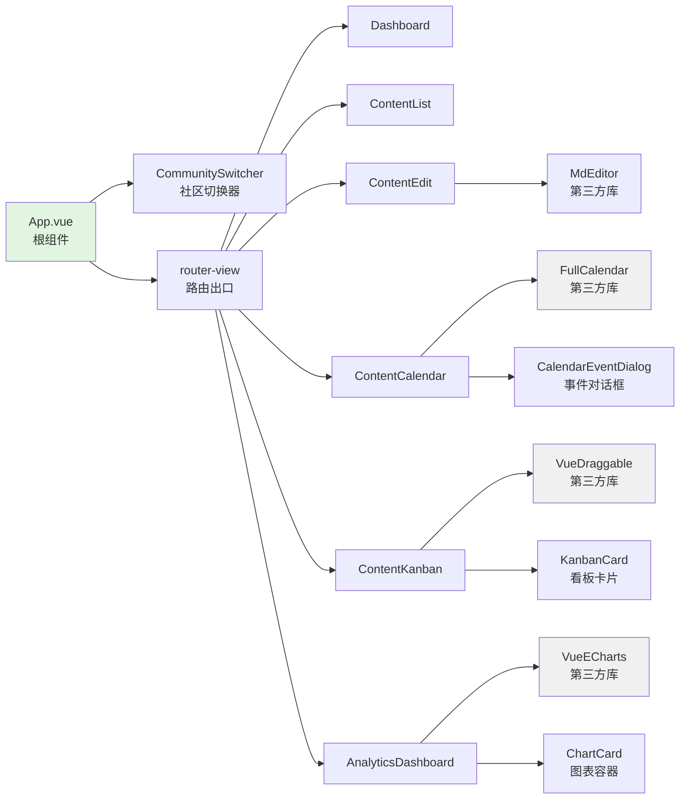

---

## 14. 用例图 (Use Case Diagram)

```mermaid
graph TB
    subgraph "Community Content Hub系统"
        UC1[登录系统]
        UC2[切换社区]
        UC3[创建内容]
        UC4[编辑内容]
        UC5[上传DOCX]
        UC6[日历排期]
        UC7[看板管理]
        UC8[发布到微信]
        UC9[发布到Hugo]
        UC10[查看数据分析]
        UC11[管理社区]
        UC12[管理成员]
        UC13[配置渠道]
    end

    User[社区运营专员]
    Admin[超级管理员]

    User --> UC1
    User --> UC2
    User --> UC3
    User --> UC4
    User --> UC5
    User --> UC6
    User --> UC7
    User --> UC8
    User --> UC9
    User --> UC10
    User --> UC13

    Admin --> UC1
    Admin --> UC2
    Admin --> UC11
    Admin --> UC12

    UC8 -.-> UC5: <<extend>><br/>需要封面图
    UC3 -.-> UC5: <<include>><br/>可选上传

    style User fill:#cce5ff
    style Admin fill:#ffcccc
```

---

## 15. 对象图示例 - 多社区运行时实例 (Object Diagram)

```mermaid
graph TB
    subgraph "运行时对象实例"
        C1[community:Community<br/>id=1<br/>name='Kubernetes']
        C2[community:Community<br/>id=2<br/>name='Prometheus']

        U1[user:User<br/>id=5<br/>username='zhangsan'<br/>is_superuser=false]
        U2[user:User<br/>id=1<br/>username='admin'<br/>is_superuser=true]

        CU1[communityUser:CommunityUser<br/>user_id=5<br/>community_id=1<br/>role='member']
        CU2[communityUser:CommunityUser<br/>user_id=5<br/>community_id=2<br/>role='member']

        Content1[content:Content<br/>id=123<br/>community_id=1<br/>title='K8s 1.28 Release'<br/>status='published']
        Content2[content:Content<br/>id=124<br/>community_id=2<br/>title='Prometheus 2.50'<br/>status='draft']

        PR1[publishRecord:PublishRecord<br/>id=456<br/>content_id=123<br/>channel='wechat'<br/>status='published']

        Config1[channelConfig:ChannelConfig<br/>community_id=1<br/>channel='wechat'<br/>config={app_id: 'wx123...'}]
        Config2[channelConfig:ChannelConfig<br/>community_id=2<br/>channel='wechat'<br/>config={app_id: 'wx456...'}]
    end

    C1 --> Content1
    C2 --> Content2
    C1 --> Config1
    C2 --> Config2
    U1 --> CU1
    U1 --> CU2
    CU1 --> C1
    CU2 --> C2
    Content1 --> PR1

    style C1 fill:#cce5ff
    style C2 fill:#cce5ff
    style U1 fill:#e1f5e1
    style U2 fill:#ffcccc
```

**说明**: 此图展示了系统运行时的对象实例关系，体现了多租户架构下：
- 用户zhangsan同时属于2个社区
- 每个社区有独立的内容和渠道配置
- 超级管理员admin可访问所有社区

---

**文档状态**: ✅ 已评审通过
**评审人**: 架构师、开发团队
**评审日期**: 2026-02-06

---

## 附录：Mermaid图表使用说明

本文档使用Mermaid文本格式描述UML图，可在以下工具中渲染查看：
- GitHub/GitLab（原生支持）
- VS Code插件：Markdown Preview Mermaid Support
- 在线工具：https://mermaid.live/
- Typora、Obsidian等Markdown编辑器
